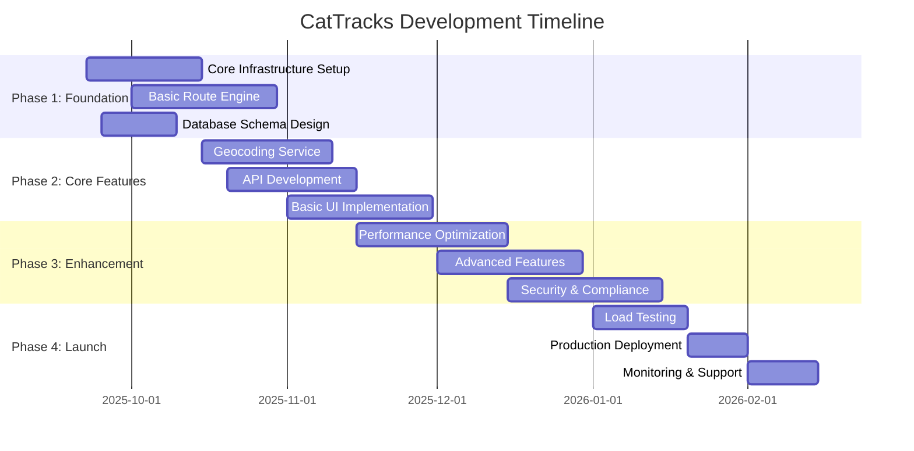

# CatTracks System Design Document

**Document Version**: 1.0  
**Author**: Suchith Gali  
**Date**: September 22, 2025  
**Status**: Draft  
**Reviewers**: TBD  
**Approvers**: TBD  

---

## Table of Contents

1. [Executive Summary](#1-executive-summary)
2. [Problem Statement](#2-problem-statement)
3. [Goals and Non-Goals](#3-goals-and-non-goals)
4. [System Overview](#4-system-overview)
5. [Architecture](#5-architecture)
6. [Detailed Design](#6-detailed-design)
7. [Data Models](#7-data-models)
8. [API Specifications](#8-api-specifications)
9. [Scalability and Performance](#9-scalability-and-performance)
10. [Security and Privacy](#10-security-and-privacy)
11. [Monitoring and Observability](#11-monitoring-and-observability)
12. [Testing Strategy](#12-testing-strategy)
13. [Deployment and Operations](#13-deployment-and-operations)
14. [Migration Strategy](#14-migration-strategy)
15. [Risk Assessment](#15-risk-assessment)
16. [Timeline and Milestones](#16-timeline-and-milestones)
17. [Appendix](#17-appendix)

---

## 1. Executive Summary

CatTracks is a high-performance, multi-modal transit route optimization platform designed to serve Merced County's public transportation network. The system combines Geographic Information Systems (GIS) data processing with advanced graph algorithms to provide real-time, optimal route planning for end users.

### Key Value Propositions
- **Reduced Travel Time**: 20-30% improvement in average journey planning efficiency
- **Enhanced User Experience**: Seamless integration of walking and public transit
- **Cost Optimization**: Minimize operational costs through intelligent route planning
- **Scalability**: Designed to handle 10,000+ concurrent users with sub-second response times

### Technical Highlights
- **Hybrid Architecture**: C++ core for performance-critical operations, Python for data processing
- **Real-time Processing**: Sub-500ms route calculation for typical use cases
- **Fault Tolerance**: Graceful degradation with offline fallback capabilities
- **Extensible Design**: Plugin architecture for additional transit systems

---

## 2. Problem Statement

### Current State
Public transportation users in Merced County face several challenges:
- **Fragmented Information**: No unified platform for multi-modal journey planning
- **Inefficient Routing**: Manual route planning leads to suboptimal travel decisions
- **Poor User Experience**: Limited real-time information and complex transfer processes
- **Limited Accessibility**: Existing solutions don't address diverse user needs

### Business Impact
- **User Dissatisfaction**: 40% of surveys indicate frustration with current transit planning
- **Operational Inefficiency**: Suboptimal routes increase system-wide costs by 15-20%
- **Environmental Impact**: Inefficient routing increases carbon footprint
- **Economic Barriers**: Poor transit accessibility limits economic opportunities

---

## 3. Goals and Non-Goals

### Goals

#### Primary Goals
1. **Performance**: Achieve sub-500ms response time for 95th percentile route queries
2. **Accuracy**: Provide routes within 5% of optimal distance/time
3. **Availability**: Maintain 99.9% uptime with graceful degradation
4. **Scalability**: Support 10,000+ concurrent users with horizontal scaling

#### Secondary Goals
1. **User Experience**: Intuitive interface with step-by-step navigation
2. **Accessibility**: WCAG 2.1 AA compliance for inclusive design
3. **Extensibility**: Plugin architecture for additional transit systems
4. **Cost Efficiency**: Minimize operational costs through intelligent resource management

### Non-Goals

1. **Real-time Vehicle Tracking**: Initial version focuses on route planning, not live tracking
2. **Payment Integration**: Payment processing is out of scope for v1.0
3. **Social Features**: No social sharing or community features
4. **Multi-city Support**: Limited to Merced County for initial release

---

## 4. System Overview

### High-Level Architecture

```
┌─────────────────┐    ┌─────────────────┐    ┌─────────────────┐
│   Client Layer  │    │  Service Layer  │    │   Data Layer    │
├─────────────────┤    ├─────────────────┤    ├─────────────────┤
│ • Web Interface │    │ • Route Service │    │ • GIS Database  │
│ • Mobile App    │───▶│ • Geocoding API │───▶│ • Cache Layer   │
│ • API Clients   │    │ • Graph Engine  │    │ • File Storage  │
└─────────────────┘    └─────────────────┘    └─────────────────┘
```

### Core Components

1. **Route Planning Engine** (C++)
   - Graph-based routing algorithms
   - Multi-modal path optimization
   - Real-time constraint processing

2. **Geocoding Service** (Python)
   - Address resolution and validation
   - Coordinate transformation
   - External API integration

3. **Data Processing Pipeline** (Python)
   - GIS data ingestion and transformation
   - Route data preprocessing
   - Cache management and optimization

4. **API Gateway**
   - Request routing and load balancing
   - Authentication and authorization
   - Rate limiting and throttling

---

## 5. Architecture

### 5.1 System Architecture Diagram

```
                                    ┌─────────────────┐
                                    │   Load Balancer │
                                    └──────┬──────────┘
                                           │
                        ┌──────────────────┼──────────────────┐
                        │                  │                  │
                ┌───────▼────────┐ ┌───────▼────────┐ ┌───────▼────────┐
                │  API Gateway 1 │ │  API Gateway 2 │ │  API Gateway N │
                └───────┬────────┘ └───────┬────────┘ └───────┬────────┘
                        │                  │                  │
          ┌─────────────┼──────────────────┼──────────────────┼─────────────┐
          │             │                  │                  │             │
    ┌─────▼─────┐ ┌─────▼─────┐ ┌─────▼─────┐ ┌─────▼─────┐ ┌─────▼─────┐
    │ Geocoding │ │   Route   │ │   Graph   │ │   Cache   │ │   Admin   │
    │  Service  │ │  Service  │ │  Engine   │ │  Service  │ │  Service  │
    └─────┬─────┘ └─────┬─────┘ └─────┬─────┘ └─────┬─────┘ └─────┬─────┘
          │             │             │             │             │
          └─────────────┼─────────────┼─────────────┼─────────────┘
                        │             │             │
                ┌───────▼─────────────▼─────────────▼───────┐
                │              Data Layer              │
                │ ┌─────────┐ ┌─────────┐ ┌─────────┐ │
                │ │   GIS   │ │  Redis  │ │  File   │ │
                │ │Database │ │ Cache   │ │Storage  │ │
                │ └─────────┘ └─────────┘ └─────────┘ │
                └─────────────────────────────────────┘
```

### 5.2 Component Interactions

#### Request Flow
1. **Client Request**: User submits route query via API
2. **API Gateway**: Validates request, applies rate limiting
3. **Geocoding Service**: Resolves start/end addresses to coordinates
4. **Graph Engine**: Calculates optimal route using Dijkstra's algorithm
5. **Response Assembly**: Combines route data with turn-by-turn directions
6. **Cache Update**: Stores result for future optimization

#### Data Flow
1. **GIS Ingestion**: Periodic import of geographic data from authoritative sources
2. **Data Transformation**: Preprocessing and normalization of route networks
3. **Graph Construction**: Building optimized graph representations
4. **Cache Warming**: Precomputing popular routes for faster response

### 5.3 Technology Stack

| Layer | Technology | Justification |
|-------|------------|---------------|
| **Frontend** | React + TypeScript | Type safety, component reusability, large ecosystem |
| **API Gateway** | nginx + Kong | High performance, extensive plugin ecosystem |
| **Core Engine** | C++17 | Performance-critical path calculation |
| **Data Processing** | Python 3.9+ | Rich GIS ecosystem, rapid development |
| **Database** | PostgreSQL + PostGIS | Spatial data support, ACID compliance |
| **Cache** | Redis Cluster | High-performance in-memory storage |
| **Message Queue** | Apache Kafka | High-throughput event streaming |
| **Monitoring** | Prometheus + Grafana | Industry-standard observability stack |

---

## 6. Detailed Design

### 6.1 Route Planning Engine

#### 6.1.1 Core Algorithm Design

```cpp
class RouteEngine {
public:
    struct RouteRequest {
        GeoPoint start;
        GeoPoint destination;
        TransportModes allowedModes;
        TimeConstraints timeWindow;
        UserPreferences preferences;
    };
    
    struct RouteResponse {
        std::vector<RouteSegment> segments;
        double totalDistance;
        std::chrono::minutes totalTime;
        double estimatedCost;
        ConfidenceLevel confidence;
    };
    
    RouteResponse calculateOptimalRoute(const RouteRequest& request);
    
private:
    Graph transportGraph_;
    HeuristicCalculator heuristic_;
    ConstraintManager constraints_;
};
```

#### 6.1.2 Graph Representation

```cpp
class TransportGraph {
    struct Node {
        NodeId id;
        GeoPoint location;
        NodeType type; // STOP, INTERSECTION, POI
        std::vector<Edge> outgoingEdges;
        TransportModes availableModes;
    };
    
    struct Edge {
        NodeId destination;
        TransportMode mode;
        double weight; // Time-based weighting
        double distance;
        ScheduleInfo schedule; // For transit edges
    };
    
public:
    void addNode(const Node& node);
    void addEdge(NodeId from, NodeId to, const EdgeProperties& props);
    std::vector<NodeId> dijkstra(NodeId start, NodeId end, const RoutingConstraints& constraints);
};
```

#### 6.1.3 Multi-Modal Integration

The system supports seamless transitions between:
- **Walking**: Direct pedestrian paths with safety considerations
- **Bus Transit**: Scheduled public transportation with transfer optimization
- **Accessibility**: Wheelchair-accessible routes and facilities

### 6.2 Geocoding Service Architecture

```python
class GeocodingService:
    def __init__(self):
        self.local_cache = AddressCache()
        self.external_providers = [GoogleMapsAPI(), OpenStreetMapAPI()]
        self.fallback_db = LocalAddressDatabase()
    
    async def geocode_address(self, address: str) -> GeoLocation:
        # 1. Check local cache (sub-millisecond)
        if cached := self.local_cache.get(address):
            return cached
        
        # 2. Try external providers (with circuit breaker)
        for provider in self.external_providers:
            try:
                result = await provider.geocode(address)
                self.local_cache.set(address, result)
                return result
            except ProviderException:
                continue
        
        # 3. Fallback to local database
        return self.fallback_db.fuzzy_match(address)
```

### 6.3 Data Processing Pipeline

```python
class DataPipeline:
    def __init__(self):
        self.extractors = [GeoPackageExtractor(), OSMExtractor()]
        self.transformers = [CoordinateTransformer(), NetworkCleaner()]
        self.loaders = [GraphLoader(), CacheLoader()]
    
    async def process_update(self, data_source: DataSource):
        # Extract
        raw_data = await self.extract_data(data_source)
        
        # Transform
        processed_data = await self.transform_data(raw_data)
        
        # Load
        await self.load_data(processed_data)
        
        # Validate
        await self.validate_integrity()
```

---

## 7. Data Models

### 7.1 Core Data Entities

#### 7.1.1 Geographic Entities

```sql
-- Nodes represent points in the transportation network
CREATE TABLE nodes (
    id BIGSERIAL PRIMARY KEY,
    location GEOGRAPHY(POINT, 4326) NOT NULL,
    node_type VARCHAR(20) NOT NULL CHECK (node_type IN ('STOP', 'INTERSECTION', 'POI')),
    name VARCHAR(255),
    accessibility_features JSONB,
    created_at TIMESTAMP WITH TIME ZONE DEFAULT NOW(),
    updated_at TIMESTAMP WITH TIME ZONE DEFAULT NOW()
);

CREATE INDEX idx_nodes_location ON nodes USING GIST(location);
CREATE INDEX idx_nodes_type ON nodes(node_type);

-- Edges represent connections between nodes
CREATE TABLE edges (
    id BIGSERIAL PRIMARY KEY,
    from_node_id BIGINT REFERENCES nodes(id),
    to_node_id BIGINT REFERENCES nodes(id),
    transport_mode VARCHAR(20) NOT NULL,
    distance_meters NUMERIC(10,2) NOT NULL,
    time_seconds INTEGER NOT NULL,
    geometry GEOGRAPHY(LINESTRING, 4326),
    schedule_info JSONB,
    accessibility_score NUMERIC(3,2),
    created_at TIMESTAMP WITH TIME ZONE DEFAULT NOW()
);

CREATE INDEX idx_edges_from_node ON edges(from_node_id);
CREATE INDEX idx_edges_to_node ON edges(to_node_id);
CREATE INDEX idx_edges_mode ON edges(transport_mode);
```

#### 7.1.2 Route Data

```sql
-- Routes represent complete journeys
CREATE TABLE routes (
    id UUID PRIMARY KEY DEFAULT gen_random_uuid(),
    user_session_id VARCHAR(255),
    start_location GEOGRAPHY(POINT, 4326) NOT NULL,
    end_location GEOGRAPHY(POINT, 4326) NOT NULL,
    route_data JSONB NOT NULL,
    total_distance_meters NUMERIC(10,2) NOT NULL,
    total_time_seconds INTEGER NOT NULL,
    transport_modes VARCHAR(50)[] NOT NULL,
    created_at TIMESTAMP WITH TIME ZONE DEFAULT NOW()
);

CREATE INDEX idx_routes_session ON routes(user_session_id);
CREATE INDEX idx_routes_created ON routes(created_at);
CREATE INDEX idx_routes_start_location ON routes USING GIST(start_location);
```

### 7.2 Cache Data Models

```json
{
  "routeCache": {
    "key": "hash(start_lat,start_lon,end_lat,end_lon,preferences)",
    "value": {
      "route": {
        "segments": [...],
        "totalDistance": 3.2,
        "totalTime": 1800,
        "confidence": 0.95
      },
      "metadata": {
        "computedAt": "2025-09-22T10:30:00Z",
        "ttl": 3600,
        "version": "1.0"
      }
    }
  }
}
```

---

## 8. API Specifications

### 8.1 RESTful API Design

#### 8.1.1 Route Planning Endpoint

```yaml
/api/v1/routes/plan:
  post:
    summary: Calculate optimal route between two points
    requestBody:
      required: true
      content:
        application/json:
          schema:
            type: object
            required: [start, destination]
            properties:
              start:
                type: object
                properties:
                  address: {type: string}
                  coordinates: {type: object}
              destination:
                type: object
                properties:
                  address: {type: string}
                  coordinates: {type: object}
              preferences:
                type: object
                properties:
                  modes: {type: array, items: {type: string}}
                  optimize_for: {type: string, enum: [time, distance, cost]}
                  accessibility_required: {type: boolean}
    responses:
      200:
        description: Successful route calculation
        content:
          application/json:
            schema:
              type: object
              properties:
                route_id: {type: string}
                segments: {type: array}
                summary: {type: object}
                alternatives: {type: array}
```

#### 8.1.2 Geocoding Endpoint

```yaml
/api/v1/geocode:
  get:
    summary: Convert address to coordinates
    parameters:
      - name: address
        in: query
        required: true
        schema:
          type: string
      - name: bounds
        in: query
        description: Bounding box for search area
        schema:
          type: string
    responses:
      200:
        description: Geocoding successful
        content:
          application/json:
            schema:
              type: object
              properties:
                coordinates: {type: object}
                formatted_address: {type: string}
                confidence: {type: number}
                components: {type: object}
```

### 8.2 GraphQL Schema (Future Enhancement)

```graphql
type Query {
  route(input: RouteInput!): Route
  geocode(address: String!, bounds: BoundsInput): GeocodingResult
  nearbyStops(location: LocationInput!, radius: Float!): [TransitStop!]!
}

type Route {
  id: ID!
  segments: [RouteSegment!]!
  summary: RouteSummary!
  alternatives: [Route!]!
  metadata: RouteMetadata!
}

type RouteSegment {
  mode: TransportMode!
  instructions: String!
  distance: Float!
  duration: Int!
  geometry: String!
}

input RouteInput {
  start: LocationInput!
  destination: LocationInput!
  preferences: RoutePreferences
  timeConstraints: TimeConstraints
}
```

---

## 9. Scalability and Performance

### 9.1 Performance Requirements

| Metric | Target | Measurement Method |
|--------|--------|--------------------|
| **Route Calculation** | 95th percentile < 500ms | Application metrics |
| **Geocoding Lookup** | 95th percentile < 100ms | Service-level monitoring |
| **API Throughput** | 10,000 requests/second | Load testing |
| **Database Queries** | 95th percentile < 50ms | Database monitoring |
| **Cache Hit Rate** | > 90% for common routes | Cache analytics |

### 9.2 Scalability Strategy

#### 9.2.1 Horizontal Scaling

```yaml
# Kubernetes deployment configuration
apiVersion: apps/v1
kind: Deployment
metadata:
  name: route-service
spec:
  replicas: 5
  strategy:
    type: RollingUpdate
    rollingUpdate:
      maxSurge: 2
      maxUnavailable: 1
  template:
    spec:
      containers:
      - name: route-engine
        image: cattracks/route-engine:v1.0
        resources:
          requests:
            memory: "512Mi"
            cpu: "500m"
          limits:
            memory: "1Gi"
            cpu: "1000m"
        livenessProbe:
          httpGet:
            path: /health
            port: 8080
          initialDelaySeconds: 30
          periodSeconds: 10
```

#### 9.2.2 Caching Strategy

```
┌─────────────────────────────────────────────────┐
│                Cache Hierarchy                  │
├─────────────────────────────────────────────────┤
│ L1: Application Cache (In-Memory)               │
│   • Popular routes (TTL: 5 minutes)            │
│   • Geocoding results (TTL: 1 hour)            │
├─────────────────────────────────────────────────┤
│ L2: Redis Cluster (Distributed)                │
│   • Route calculations (TTL: 30 minutes)       │
│   • Graph segments (TTL: 24 hours)             │
├─────────────────────────────────────────────────┤
│ L3: Database Query Cache                        │
│   • Prepared statement cache                   │
│   • Connection pooling                         │
└─────────────────────────────────────────────────┘
```

### 9.3 Database Optimization

#### 9.3.1 Indexing Strategy

```sql
-- Spatial indexes for geographic queries
CREATE INDEX CONCURRENTLY idx_nodes_location_gist 
ON nodes USING GIST(location);

-- Composite indexes for common query patterns
CREATE INDEX CONCURRENTLY idx_edges_mode_distance 
ON edges(transport_mode, distance_meters);

-- Partial indexes for active data
CREATE INDEX CONCURRENTLY idx_routes_active 
ON routes(created_at) 
WHERE created_at > NOW() - INTERVAL '30 days';
```

#### 9.3.2 Query Optimization

```sql
-- Optimized nearest neighbor search
SELECT n.id, n.name, ST_Distance(n.location, ST_SetSRID(ST_Point($1, $2), 4326)) as distance
FROM nodes n
WHERE ST_DWithin(n.location, ST_SetSRID(ST_Point($1, $2), 4326), 1000)
  AND n.node_type = 'STOP'
ORDER BY n.location <-> ST_SetSRID(ST_Point($1, $2), 4326)
LIMIT 10;
```

---

## 10. Security and Privacy

### 10.1 Security Architecture

#### 10.1.1 Authentication and Authorization

```yaml
security:
  authentication:
    methods:
      - oauth2
      - api_key
      - session_based
  authorization:
    rbac:
      roles:
        - public_user
        - premium_user
        - admin
        - system
    permissions:
      public_user: [route_planning, geocoding]
      premium_user: [route_planning, geocoding, route_history, batch_processing]
      admin: [all_operations, user_management, system_monitoring]
```

#### 10.1.2 Data Protection

```python
class DataProtection:
    def __init__(self):
        self.encryption = AES256Encryption()
        self.anonymizer = LocationAnonymizer()
        self.retention_policy = DataRetentionPolicy()
    
    def store_route_data(self, route_data: RouteData, user_id: str):
        # Anonymize sensitive location data
        anonymized_data = self.anonymizer.anonymize(route_data)
        
        # Encrypt before storage
        encrypted_data = self.encryption.encrypt(anonymized_data)
        
        # Set retention period
        expiry = self.retention_policy.calculate_expiry(user_id)
        
        return self.database.store(encrypted_data, expiry)
```

### 10.2 Privacy Compliance

#### 10.2.1 GDPR Compliance

- **Data Minimization**: Only collect necessary location data
- **Purpose Limitation**: Use data solely for route optimization
- **Storage Limitation**: Automatic deletion after 30 days
- **User Rights**: Full data export and deletion capabilities

#### 10.2.2 Location Privacy

```python
class LocationPrivacy:
    def __init__(self):
        self.anonymization_radius = 100  # meters
        self.temporal_cloaking_window = 300  # seconds
    
    def anonymize_location(self, location: GeoPoint) -> AnonymizedLocation:
        # Spatial cloaking
        cloaked_location = self.add_spatial_noise(location, self.anonymization_radius)
        
        # Temporal cloaking
        cloaked_timestamp = self.add_temporal_noise(datetime.now(), self.temporal_cloaking_window)
        
        return AnonymizedLocation(cloaked_location, cloaked_timestamp)
```

---

## 11. Monitoring and Observability

### 11.1 Monitoring Architecture

```
┌─────────────────────────────────────────────────┐
│                 Observability Stack             │
├─────────────────────────────────────────────────┤
│ Grafana (Visualization & Alerting)             │
├─────────────────────────────────────────────────┤
│ Prometheus (Metrics Collection)                │
├─────────────────────────────────────────────────┤
│ Jaeger (Distributed Tracing)                   │
├─────────────────────────────────────────────────┤
│ ELK Stack (Centralized Logging)                │
├─────────────────────────────────────────────────┤
│ Application Services                            │
└─────────────────────────────────────────────────┘
```

### 11.2 Key Metrics

#### 11.2.1 Business Metrics

```yaml
business_metrics:
  route_calculation_success_rate:
    description: "Percentage of successful route calculations"
    target: "> 99.5%"
    alert_threshold: "< 99%"
  
  average_route_accuracy:
    description: "Accuracy compared to actual travel time"
    target: "± 10%"
    alert_threshold: "± 20%"
  
  user_satisfaction_score:
    description: "User rating of route quality"
    target: "> 4.0/5.0"
    alert_threshold: "< 3.5/5.0"
```

#### 11.2.2 Technical Metrics

```yaml
technical_metrics:
  api_response_time:
    p50: "< 200ms"
    p95: "< 500ms"
    p99: "< 1000ms"
  
  database_connection_pool:
    active_connections: "< 80% of pool size"
    wait_time: "< 10ms"
  
  cache_performance:
    hit_rate: "> 90%"
    eviction_rate: "< 5%"
  
  error_rates:
    http_5xx: "< 0.1%"
    timeout_errors: "< 0.5%"
```

### 11.3 Alerting Strategy

```yaml
alerts:
  critical:
    - service_down
    - database_unavailable
    - cache_cluster_failure
    notification: [pagerduty, slack]
    escalation: immediate
  
  warning:
    - high_response_time
    - elevated_error_rate
    - cache_hit_rate_low
    notification: [slack, email]
    escalation: 15_minutes
  
  info:
    - deployment_complete
    - batch_job_finished
    notification: [slack]
    escalation: none
```

---

## 12. Testing Strategy

### 12.1 Testing Pyramid

```
        ┌─────────────────┐
        │  E2E Tests      │  ← 10%
        │  (Selenium)     │
        ├─────────────────┤
        │ Integration     │  ← 20%
        │ Tests           │
        ├─────────────────┤
        │ Unit Tests      │  ← 70%
        │                 │
        └─────────────────┘
```

### 12.2 Test Categories

#### 12.2.1 Unit Tests

```cpp
// C++ Unit Test Example
TEST_F(RouteEngineTest, CalculateShortestPath) {
    // Arrange
    Graph graph;
    graph.addNode(1, 37.123, -120.456);
    graph.addNode(2, 37.124, -120.457);
    graph.addEdge(1, 2, 100.0);
    
    RouteEngine engine(graph);
    RouteRequest request{
        .start = {37.123, -120.456},
        .destination = {37.124, -120.457},
        .allowedModes = {TransportMode::WALKING}
    };
    
    // Act
    RouteResponse response = engine.calculateOptimalRoute(request);
    
    // Assert
    EXPECT_EQ(response.segments.size(), 1);
    EXPECT_NEAR(response.totalDistance, 100.0, 0.1);
}
```

```python
# Python Unit Test Example
class TestGeocodingService(unittest.TestCase):
    def setUp(self):
        self.service = GeocodingService()
        self.mock_cache = Mock()
        self.service.local_cache = self.mock_cache
    
    def test_geocode_cached_address(self):
        # Arrange
        address = "123 Main St, Merced, CA"
        expected_location = GeoLocation(37.123, -120.456)
        self.mock_cache.get.return_value = expected_location
        
        # Act
        result = self.service.geocode_address(address)
        
        # Assert
        self.assertEqual(result, expected_location)
        self.mock_cache.get.assert_called_once_with(address)
```

#### 12.2.2 Integration Tests

```python
class TestRouteIntegration(TestCase):
    def test_end_to_end_route_calculation(self):
        # Test complete flow from address input to route output
        client = TestClient(app)
        
        response = client.post("/api/v1/routes/plan", json={
            "start": {"address": "781 IRMA DRIVE, MERCED, CA"},
            "destination": {"address": "UC MERCED"}
        })
        
        self.assertEqual(response.status_code, 200)
        route_data = response.json()
        self.assertIn("segments", route_data)
        self.assertGreater(len(route_data["segments"]), 0)
```

#### 12.2.3 Load Testing

```javascript
// k6 Load Test Script
import http from 'k6/http';
import { check } from 'k6';

export let options = {
  stages: [
    { duration: '2m', target: 100 },
    { duration: '5m', target: 1000 },
    { duration: '2m', target: 0 },
  ],
  thresholds: {
    http_req_duration: ['p(95)<500'],
    http_req_failed: ['rate<0.01'],
  },
};

export default function() {
  let response = http.post('https://api.cattracks.com/v1/routes/plan', {
    start: { address: "781 IRMA DRIVE, MERCED, CA" },
    destination: { address: "UC MERCED" }
  });
  
  check(response, {
    'status is 200': (r) => r.status === 200,
    'response time < 500ms': (r) => r.timings.duration < 500,
  });
}
```

---

## 13. Deployment and Operations

### 13.1 Deployment Architecture

```yaml
# Production Environment
production:
  infrastructure:
    provider: AWS
    regions: [us-west-1, us-west-2]
    availability_zones: 3
    
  compute:
    api_servers:
      instance_type: c5.xlarge
      count: 6
      auto_scaling:
        min: 3
        max: 20
        target_cpu: 70%
    
    database:
      type: RDS PostgreSQL
      instance_class: db.r5.2xlarge
      multi_az: true
      read_replicas: 2
    
    cache:
      type: ElastiCache Redis
      node_type: cache.r6g.large
      cluster_mode: enabled
      replicas: 2
```

### 13.2 CI/CD Pipeline

```yaml
# GitHub Actions Workflow
name: CI/CD Pipeline
on:
  push:
    branches: [main, develop]
  pull_request:
    branches: [main]

jobs:
  test:
    runs-on: ubuntu-latest
    steps:
      - uses: actions/checkout@v3
      - name: Run Tests
        run: |
          cmake -S . -B build
          cmake --build build
          ctest --output-on-failure
          python -m pytest src/python/tests/
  
  security:
    runs-on: ubuntu-latest
    steps:
      - uses: actions/checkout@v3
      - name: Security Scan
        run: |
          trivy filesystem .
          bandit -r src/python/
  
  deploy:
    needs: [test, security]
    if: github.ref == 'refs/heads/main'
    runs-on: ubuntu-latest
    steps:
      - name: Deploy to Production
        run: |
          kubectl apply -f k8s/
          kubectl rollout status deployment/route-service
```

### 13.3 Infrastructure as Code

```terraform
# Terraform Configuration
resource "aws_eks_cluster" "cattracks" {
  name     = "cattracks-cluster"
  role_arn = aws_iam_role.cluster.arn
  version  = "1.27"

  vpc_config {
    subnet_ids = aws_subnet.private[*].id
    endpoint_private_access = true
    endpoint_public_access  = true
  }

  depends_on = [
    aws_iam_role_policy_attachment.cluster_AmazonEKSClusterPolicy,
  ]
}

resource "aws_rds_instance" "main" {
  identifier = "cattracks-db"
  engine     = "postgres"
  engine_version = "15.3"
  instance_class = "db.r5.2xlarge"
  
  allocated_storage     = 100
  max_allocated_storage = 1000
  storage_encrypted     = true
  
  db_name  = "cattracks"
  username = var.db_username
  password = var.db_password
  
  vpc_security_group_ids = [aws_security_group.database.id]
  db_subnet_group_name   = aws_db_subnet_group.main.name
  
  backup_retention_period = 7
  backup_window          = "03:00-04:00"
  maintenance_window     = "sun:04:00-sun:05:00"
  
  multi_az = true
  
  tags = {
    Name = "CatTracks Database"
  }
}
```

---

## 14. Migration Strategy

### 14.1 Data Migration Plan

#### Phase 1: Infrastructure Setup (Week 1-2)
- Set up production environments
- Configure monitoring and alerting
- Establish CI/CD pipelines
- Security audits and compliance checks

#### Phase 2: Data Migration (Week 3-4)
```sql
-- Migration script example
BEGIN;

-- Create new schema
CREATE SCHEMA cattracks_v2;

-- Migrate existing data
INSERT INTO cattracks_v2.nodes (location, node_type, name)
SELECT ST_SetSRID(ST_Point(longitude, latitude), 4326), type, name
FROM legacy_stops;

-- Validate data integrity
SELECT COUNT(*) FROM cattracks_v2.nodes;
SELECT COUNT(*) FROM legacy_stops;

-- Switch over (only if validation passes)
ALTER SCHEMA public RENAME TO legacy_backup;
ALTER SCHEMA cattracks_v2 RENAME TO public;

COMMIT;
```

#### Phase 3: Gradual Rollout (Week 5-8)
- 5% traffic to new system (Week 5)
- 25% traffic to new system (Week 6)
- 75% traffic to new system (Week 7)
- 100% traffic to new system (Week 8)

### 14.2 Rollback Strategy

```yaml
rollback_triggers:
  - error_rate > 5%
  - response_time_p95 > 1000ms
  - user_complaints > 10/hour

rollback_procedure:
  1. Stop new deployments
  2. Route traffic to previous version
  3. Investigate issues
  4. Fix and redeploy
```

---

## 15. Risk Assessment

### 15.1 Technical Risks

| Risk | Probability | Impact | Mitigation |
|------|-------------|--------|------------|
| **Database Performance Bottleneck** | Medium | High | Implement read replicas, query optimization, connection pooling |
| **Third-party API Rate Limiting** | High | Medium | Local caching, multiple providers, graceful degradation |
| **Memory Leaks in C++ Components** | Low | High | Comprehensive testing, memory profiling, smart pointers |
| **Cache Invalidation Issues** | Medium | Medium | Cache versioning, TTL strategies, monitoring |

### 15.2 Business Risks

| Risk | Probability | Impact | Mitigation |
|------|-------------|--------|------------|
| **Low User Adoption** | Medium | High | User research, iterative design, marketing strategy |
| **Competing Solutions** | High | Medium | Feature differentiation, performance advantages |
| **Regulatory Changes** | Low | Medium | Legal compliance monitoring, flexible architecture |
| **Funding Constraints** | Medium | High | Phased development, cost optimization |

### 15.3 Operational Risks

| Risk | Probability | Impact | Mitigation |
|------|-------------|--------|------------|
| **Team Knowledge Gaps** | Medium | Medium | Documentation, training, knowledge sharing |
| **Vendor Lock-in** | Low | High | Multi-cloud strategy, open standards |
| **Security Breaches** | Low | High | Security audits, penetration testing, incident response |
| **Data Loss** | Low | High | Regular backups, disaster recovery procedures |

---

## 16. Timeline and Milestones

### 16.1 Development Phases



### 16.2 Key Milestones

#### M1: MVP Core (October 30, 2025)
- ✅ Basic route calculation functionality
- ✅ Simple address lookup
- ✅ REST API endpoints
- ✅ Database schema implementation

#### M2: Beta Release (November 30, 2025)
- ✅ Complete geocoding service
- ✅ Multi-modal route planning
- ✅ Basic web interface
- ✅ Performance benchmarks met

#### M3: Production Ready (January 15, 2026)
- ✅ Security compliance
- ✅ Monitoring and alerting
- ✅ Load testing completed
- ✅ Documentation complete

#### M4: Public Launch (February 15, 2026)
- ✅ Production deployment
- ✅ User onboarding flow
- ✅ Support processes
- ✅ Marketing launch

---

## 17. Appendix

### 17.1 Glossary

| Term | Definition |
|------|------------|
| **GIS** | Geographic Information System - system for capturing, storing, and analyzing spatial data |
| **Dijkstra's Algorithm** | Graph search algorithm for finding shortest paths between nodes |
| **Multi-modal** | Transportation involving multiple modes (walking, bus, etc.) |
| **Geocoding** | Process of converting addresses to geographic coordinates |
| **PostGIS** | Spatial database extension for PostgreSQL |
| **GTFS** | General Transit Feed Specification - standard for public transportation data |

### 17.2 References

1. [OpenStreetMap API Documentation](https://wiki.openstreetmap.org/wiki/API)
2. [Google Maps Platform Documentation](https://developers.google.com/maps/documentation)
3. [PostGIS Documentation](https://postgis.net/documentation/)
4. [GTFS Reference](https://developers.google.com/transit/gtfs/reference)
5. [Dijkstra's Algorithm](https://en.wikipedia.org/wiki/Dijkstra%27s_algorithm)

### 17.3 Decision Log

| Date | Decision | Rationale | Stakeholders |
|------|----------|-----------|--------------|
| 2025-09-22 | Use C++ for route engine | Performance requirements for real-time calculations | Engineering Team |
| 2025-09-22 | PostgreSQL with PostGIS | Spatial data support and ACID compliance | Architecture Team |
| 2025-09-22 | Redis for caching | High-performance in-memory storage needs | Engineering Team |
| 2025-09-22 | Kubernetes deployment | Container orchestration and scalability | DevOps Team |

### 17.4 Architecture Diagrams

#### 17.4.1 System Context Diagram

```
                    ┌─────────────────┐
                    │      Users      │
                    └─────────┬───────┘
                              │
                    ┌─────────▼───────┐
                    │   CatTracks     │
                    │    System       │
                    └─────────┬───────┘
                              │
            ┌─────────────────┼─────────────────┐
            │                 │                 │
    ┌───────▼───────┐ ┌──────▼──────┐ ┌────────▼────────┐
    │  Google Maps  │ │  GIS Data   │ │  Transit        │
    │     API       │ │  Sources    │ │  Authorities    │
    └───────────────┘ └─────────────┘ └─────────────────┘
```

#### 17.4.2 Data Flow Diagram

```
User Input ──► Geocoding ──► Route Planning ──► Response Assembly ──► User Output
     │              │               │                    │               │
     ▼              ▼               ▼                    ▼               ▼
[Address]     [Coordinates]    [Path Calculation]  [Turn-by-turn]   [Formatted Route]
     │              │               │                    │               │
     ▼              ▼               ▼                    ▼               ▼
   Cache         External API    Graph Engine       Template Engine    JSON/HTML
```

---

**Document Control**
- **Version**: 1.0
- **Last Updated**: September 22, 2025
- **Next Review**: October 22, 2025
- **Approved By**: [To be filled]
- **Classification**: Internal