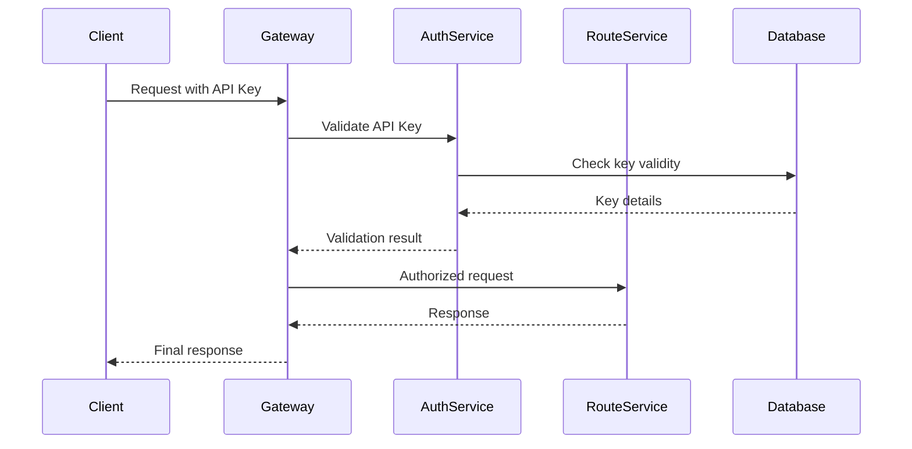

# Technical Architecture Specification (TAS)

**Document Type**: Technical Architecture Specification  
**System**: CatTracks Transit Optimization Platform  
**Version**: 1.0  
**Date**: September 22, 2025  
**Classification**: Confidential  

---

## Document Summary

This Technical Architecture Specification defines the detailed technical implementation of the CatTracks system, including component interfaces, data schemas, performance characteristics, and operational requirements.

---

## 1. Architecture Overview

### 1.1 Reference Architecture

```
┌─────────────────────────────────────────────────────────────┐
│                    External Systems                         │
├─────────────────────────────────────────────────────────────┤
│ Google Maps API │ OSM Data │ Transit Feeds │ GIS Sources   │
└─────────────────┬───────────┬──────────────┬────────────────┘
                  │           │              │
┌─────────────────▼───────────▼──────────────▼────────────────┐
│                    Integration Layer                        │
├─────────────────────────────────────────────────────────────┤
│ API Gateway │ Rate Limiter │ Circuit Breaker │ Load Balancer│
└─────────────────┬───────────────────────────────────────────┘
                  │
┌─────────────────▼───────────────────────────────────────────┐
│                   Service Layer                             │
├─────────────────────────────────────────────────────────────┤
│ Route Service │ Geocoding │ Graph Engine │ Cache Service    │
└─────────────────┬───────────────────────────────────────────┘
                  │
┌─────────────────▼───────────────────────────────────────────┐
│                    Data Layer                               │
├─────────────────────────────────────────────────────────────┤
│ PostgreSQL │ Redis Cluster │ File Storage │ Message Queue   │
└─────────────────────────────────────────────────────────────┘
```

### 1.2 Technology Stack Matrix

| Component | Technology | Version | Justification |
|-----------|------------|---------|---------------|
| **API Gateway** | Kong | 3.4+ | Enterprise features, plugin ecosystem |
| **Load Balancer** | HAProxy | 2.8+ | High performance, health checking |
| **Container Runtime** | Docker | 24.0+ | Industry standard, ecosystem |
| **Orchestration** | Kubernetes | 1.28+ | Scalability, service mesh ready |
| **Service Mesh** | Istio | 1.19+ | Traffic management, security |
| **Database** | PostgreSQL | 15+ | Spatial support, reliability |
| **Spatial Extension** | PostGIS | 3.4+ | Advanced spatial operations |
| **Cache** | Redis | 7.2+ | Performance, clustering |
| **Message Queue** | Apache Kafka | 3.5+ | Stream processing, durability |
| **Monitoring** | Prometheus | 2.47+ | Metrics collection, alerting |
| **Tracing** | Jaeger | 1.49+ | Distributed tracing |
| **Logging** | ELK Stack | 8.9+ | Centralized logging, search |

---

## 2. Component Specifications

### 2.1 Route Planning Engine

#### 2.1.1 Component Interface

```cpp
namespace cattracks::routing {

class IRouteEngine {
public:
    virtual ~IRouteEngine() = default;
    
    virtual RouteResult calculateRoute(
        const RouteRequest& request,
        const RoutingConstraints& constraints = {}
    ) const = 0;
    
    virtual std::vector<RouteResult> calculateAlternatives(
        const RouteRequest& request,
        size_t maxAlternatives = 3
    ) const = 0;
    
    virtual RouteValidationResult validateRoute(
        const RouteResult& route
    ) const = 0;
};

struct RouteRequest {
    GeoPoint origin;
    GeoPoint destination;
    std::chrono::system_clock::time_point departureTime;
    TransportPreferences preferences;
    AccessibilityRequirements accessibility;
};

struct RouteResult {
    RouteId id;
    std::vector<RouteSegment> segments;
    RouteSummary summary;
    RouteMetrics metrics;
    std::chrono::system_clock::time_point computedAt;
};

} // namespace cattracks::routing
```

#### 2.1.2 Implementation Architecture

```cpp
class ProductionRouteEngine : public IRouteEngine {
private:
    std::unique_ptr<GraphStorage> graphStorage_;
    std::unique_ptr<AlgorithmEngine> algorithmEngine_;
    std::unique_ptr<RouteOptimizer> optimizer_;
    std::unique_ptr<MetricsCollector> metrics_;
    
public:
    RouteResult calculateRoute(
        const RouteRequest& request,
        const RoutingConstraints& constraints
    ) const override {
        
        auto timer = metrics_->startTimer("route_calculation");
        
        try {
            // 1. Validate input
            validateRequest(request, constraints);
            
            // 2. Load relevant graph data
            auto graphSubset = graphStorage_->getSubgraph(
                request.origin, 
                request.destination, 
                SEARCH_RADIUS_KM
            );
            
            // 3. Execute pathfinding algorithm
            auto rawPath = algorithmEngine_->findShortestPath(
                graphSubset,
                request.origin,
                request.destination,
                constraints
            );
            
            // 4. Optimize and refine
            auto optimizedRoute = optimizer_->optimize(rawPath, request.preferences);
            
            // 5. Generate detailed instructions
            auto detailedRoute = generateInstructions(optimizedRoute);
            
            metrics_->recordSuccess("route_calculation", timer.elapsed());
            return detailedRoute;
            
        } catch (const std::exception& e) {
            metrics_->recordFailure("route_calculation", e.what());
            throw;
        }
    }
};
```

### 2.2 Geocoding Service

#### 2.2.1 Service Interface

```python
from abc import ABC, abstractmethod
from typing import List, Optional
from dataclasses import dataclass
from enum import Enum

class ConfidenceLevel(Enum):
    HIGH = "high"      # > 0.9
    MEDIUM = "medium"  # 0.7 - 0.9
    LOW = "low"        # 0.5 - 0.7
    VERY_LOW = "very_low"  # < 0.5

@dataclass
class GeocodingResult:
    coordinates: GeoPoint
    formatted_address: str
    confidence: float
    confidence_level: ConfidenceLevel
    components: AddressComponents
    source: str
    cached: bool

class IGeocodingService(ABC):
    @abstractmethod
    async def geocode(self, address: str, options: GeocodingOptions = None) -> GeocodingResult:
        """Geocode a single address to coordinates."""
        pass
    
    @abstractmethod
    async def reverse_geocode(self, coordinates: GeoPoint) -> GeocodingResult:
        """Reverse geocode coordinates to address."""
        pass
    
    @abstractmethod
    async def batch_geocode(self, addresses: List[str]) -> List[GeocodingResult]:
        """Geocode multiple addresses efficiently."""
        pass
```

#### 2.2.2 Production Implementation

```python
class ProductionGeocodingService(IGeocodingService):
    def __init__(self):
        self.cache = CacheManager()
        self.providers = [
            GoogleMapsProvider(priority=1),
            OpenStreetMapProvider(priority=2),
            LocalDatabaseProvider(priority=3)
        ]
        self.circuit_breaker = CircuitBreaker()
        self.rate_limiter = RateLimiter()
        self.metrics = MetricsCollector()
    
    async def geocode(
        self, 
        address: str, 
        options: GeocodingOptions = None
    ) -> GeocodingResult:
        
        with self.metrics.timer("geocoding_request"):
            # 1. Normalize input
            normalized_address = self._normalize_address(address)
            
            # 2. Check cache first
            cache_key = self._generate_cache_key(normalized_address, options)
            if cached_result := await self.cache.get(cache_key):
                self.metrics.increment("geocoding_cache_hit")
                return cached_result
            
            # 3. Try providers in priority order
            for provider in self.providers:
                if not self.circuit_breaker.is_available(provider.name):
                    continue
                
                try:
                    # Apply rate limiting
                    await self.rate_limiter.acquire(provider.name)
                    
                    result = await provider.geocode(normalized_address, options)
                    
                    if result.confidence_level in [ConfidenceLevel.HIGH, ConfidenceLevel.MEDIUM]:
                        # Cache successful results
                        await self.cache.set(cache_key, result, ttl=3600)
                        self.metrics.increment(f"geocoding_success_{provider.name}")
                        return result
                        
                except Exception as e:
                    self.circuit_breaker.record_failure(provider.name)
                    self.metrics.increment(f"geocoding_error_{provider.name}")
                    logger.warning(f"Provider {provider.name} failed: {e}")
                    continue
            
            # 4. All providers failed
            raise GeocodingException("All geocoding providers failed")
```

### 2.3 Data Access Layer

#### 2.3.1 Repository Pattern Implementation

```python
from sqlalchemy.ext.asyncio import AsyncSession
from typing import Protocol, List, Optional

class INodeRepository(Protocol):
    async def find_by_id(self, node_id: int) -> Optional[Node]:
        ...
    
    async def find_nearby(
        self, 
        location: GeoPoint, 
        radius_meters: float,
        node_types: List[NodeType] = None
    ) -> List[Node]:
        ...
    
    async def find_by_bounding_box(
        self, 
        bbox: BoundingBox
    ) -> List[Node]:
        ...

class PostgreSQLNodeRepository:
    def __init__(self, session: AsyncSession):
        self.session = session
    
    async def find_nearby(
        self, 
        location: GeoPoint, 
        radius_meters: float,
        node_types: List[NodeType] = None
    ) -> List[Node]:
        
        query = select(NodeEntity).where(
            func.ST_DWithin(
                NodeEntity.location,
                func.ST_SetSRID(func.ST_Point(location.longitude, location.latitude), 4326),
                radius_meters
            )
        )
        
        if node_types:
            query = query.where(NodeEntity.node_type.in_([nt.value for nt in node_types]))
        
        query = query.order_by(
            func.ST_Distance(
                NodeEntity.location,
                func.ST_SetSRID(func.ST_Point(location.longitude, location.latitude), 4326)
            )
        ).limit(100)
        
        result = await self.session.execute(query)
        entities = result.scalars().all()
        
        return [self._entity_to_domain(entity) for entity in entities]
```

---

## 3. Performance Specifications

### 3.1 Latency Requirements

| Operation | P50 | P95 | P99 | P99.9 |
|-----------|-----|-----|-----|-------|
| **Route Calculation** | 150ms | 400ms | 800ms | 1.5s |
| **Geocoding (Cached)** | 5ms | 15ms | 30ms | 50ms |
| **Geocoding (API)** | 80ms | 200ms | 500ms | 1s |
| **Database Query** | 10ms | 30ms | 80ms | 200ms |
| **Cache Lookup** | 1ms | 3ms | 8ms | 15ms |

### 3.2 Throughput Requirements

| Service | Target RPS | Peak RPS | Scaling Strategy |
|---------|------------|----------|------------------|
| **Route Planning** | 1,000 | 5,000 | Horizontal pod autoscaling |
| **Geocoding** | 2,000 | 10,000 | Provider load balancing |
| **API Gateway** | 10,000 | 50,000 | Multiple availability zones |
| **Database** | 5,000 | 25,000 | Read replicas + connection pooling |

### 3.3 Resource Utilization

```yaml
resource_limits:
  route_service:
    cpu: "1000m"
    memory: "2Gi"
    storage: "10Gi"
  
  geocoding_service:
    cpu: "500m"
    memory: "1Gi"
    storage: "5Gi"
  
  database:
    cpu: "4000m"
    memory: "16Gi"
    storage: "1Ti"
    iops: 10000
```

---

## 4. Security Architecture

### 4.1 Authentication Flow



### 4.2 Data Protection Implementation

```python
class DataProtectionService:
    def __init__(self):
        self.encryption = AESEncryption(key_size=256)
        self.hasher = SHA256Hasher()
        self.anonymizer = LocationAnonymizer()
    
    def protect_route_data(self, route_data: RouteData, user_context: UserContext) -> ProtectedData:
        # 1. Anonymize personally identifiable locations
        anonymized_data = self.anonymizer.anonymize_locations(
            route_data, 
            anonymization_radius=100  # meters
        )
        
        # 2. Hash user identifiers
        hashed_user_id = self.hasher.hash(user_context.user_id + user_context.session_salt)
        
        # 3. Encrypt sensitive data
        encrypted_data = self.encryption.encrypt(anonymized_data.to_json())
        
        return ProtectedData(
            encrypted_payload=encrypted_data,
            user_hash=hashed_user_id,
            protection_level=ProtectionLevel.HIGH,
            expiry_time=datetime.now() + timedelta(hours=24)
        )
```

### 4.3 Network Security

```yaml
# Kubernetes Network Policies
apiVersion: networking.k8s.io/v1
kind: NetworkPolicy
metadata:
  name: route-service-policy
spec:
  podSelector:
    matchLabels:
      app: route-service
  policyTypes:
  - Ingress
  - Egress
  ingress:
  - from:
    - namespaceSelector:
        matchLabels:
          name: api-gateway
    ports:
    - protocol: TCP
      port: 8080
  egress:
  - to:
    - namespaceSelector:
        matchLabels:
          name: database
    ports:
    - protocol: TCP
      port: 5432
```

---

## 5. Observability Implementation

### 5.1 Metrics Collection

```python
from prometheus_client import Counter, Histogram, Gauge
import time

class ServiceMetrics:
    def __init__(self):
        self.request_count = Counter(
            'route_requests_total',
            'Total route requests',
            ['method', 'status']
        )
        
        self.request_duration = Histogram(
            'route_request_duration_seconds',
            'Route request duration',
            ['method'],
            buckets=[0.1, 0.25, 0.5, 1.0, 2.5, 5.0, 10.0]
        )
        
        self.active_connections = Gauge(
            'database_connections_active',
            'Active database connections'
        )
    
    def record_request(self, method: str, status: str, duration: float):
        self.request_count.labels(method=method, status=status).inc()
        self.request_duration.labels(method=method).observe(duration)
    
    def update_db_connections(self, count: int):
        self.active_connections.set(count)
```

### 5.2 Distributed Tracing

```python
from opentelemetry import trace
from opentelemetry.exporter.jaeger.thrift import JaegerExporter
from opentelemetry.sdk.trace import TracerProvider
from opentelemetry.sdk.trace.export import BatchSpanProcessor

class TracingService:
    def __init__(self):
        trace.set_tracer_provider(TracerProvider())
        tracer = trace.get_tracer(__name__)
        
        jaeger_exporter = JaegerExporter(
            agent_host_name="jaeger-agent",
            agent_port=6831,
        )
        
        span_processor = BatchSpanProcessor(jaeger_exporter)
        trace.get_tracer_provider().add_span_processor(span_processor)
    
    def trace_route_calculation(self, request: RouteRequest) -> RouteResult:
        with trace.get_tracer(__name__).start_as_current_span("calculate_route") as span:
            span.set_attribute("route.origin.lat", request.origin.latitude)
            span.set_attribute("route.origin.lon", request.origin.longitude)
            span.set_attribute("route.destination.lat", request.destination.latitude)
            span.set_attribute("route.destination.lon", request.destination.longitude)
            
            # Actual route calculation
            result = self._calculate_route_internal(request)
            
            span.set_attribute("route.segments.count", len(result.segments))
            span.set_attribute("route.total_distance", result.summary.total_distance)
            
            return result
```

### 5.3 Alerting Rules

```yaml
# Prometheus Alerting Rules
groups:
- name: cattracks.rules
  rules:
  - alert: HighErrorRate
    expr: rate(route_requests_total{status="error"}[5m]) > 0.05
    for: 2m
    labels:
      severity: critical
    annotations:
      summary: "High error rate detected"
      description: "Error rate is {{ $value }} which is above threshold"
  
  - alert: HighLatency
    expr: histogram_quantile(0.95, rate(route_request_duration_seconds_bucket[5m])) > 1.0
    for: 5m
    labels:
      severity: warning
    annotations:
      summary: "High latency detected"
      description: "95th percentile latency is {{ $value }}s"
  
  - alert: DatabaseConnectionsHigh
    expr: database_connections_active > 80
    for: 1m
    labels:
      severity: warning
    annotations:
      summary: "Database connection pool nearly exhausted"
```

---

## 6. Deployment Configuration

### 6.1 Kubernetes Manifests

```yaml
# Route Service Deployment
apiVersion: apps/v1
kind: Deployment
metadata:
  name: route-service
  labels:
    app: route-service
    version: v1.0
spec:
  replicas: 3
  strategy:
    type: RollingUpdate
    rollingUpdate:
      maxSurge: 1
      maxUnavailable: 0
  selector:
    matchLabels:
      app: route-service
  template:
    metadata:
      labels:
        app: route-service
        version: v1.0
    spec:
      containers:
      - name: route-service
        image: cattracks/route-service:v1.0.0
        ports:
        - containerPort: 8080
          name: http
        env:
        - name: DATABASE_URL
          valueFrom:
            secretKeyRef:
              name: database-credentials
              key: url
        - name: REDIS_URL
          valueFrom:
            configMapKeyRef:
              name: cache-config
              key: redis-url
        resources:
          requests:
            cpu: 500m
            memory: 1Gi
          limits:
            cpu: 1000m
            memory: 2Gi
        livenessProbe:
          httpGet:
            path: /health
            port: 8080
          initialDelaySeconds: 30
          periodSeconds: 10
        readinessProbe:
          httpGet:
            path: /ready
            port: 8080
          initialDelaySeconds: 5
          periodSeconds: 5
        volumeMounts:
        - name: config-volume
          mountPath: /etc/config
      volumes:
      - name: config-volume
        configMap:
          name: route-service-config
```

### 6.2 Service Configuration

```yaml
# Service Definition
apiVersion: v1
kind: Service
metadata:
  name: route-service
  labels:
    app: route-service
spec:
  type: ClusterIP
  ports:
  - port: 8080
    targetPort: 8080
    protocol: TCP
    name: http
  selector:
    app: route-service

---
# Horizontal Pod Autoscaler
apiVersion: autoscaling/v2
kind: HorizontalPodAutoscaler
metadata:
  name: route-service-hpa
spec:
  scaleTargetRef:
    apiVersion: apps/v1
    kind: Deployment
    name: route-service
  minReplicas: 3
  maxReplicas: 20
  metrics:
  - type: Resource
    resource:
      name: cpu
      target:
        type: Utilization
        averageUtilization: 70
  - type: Resource
    resource:
      name: memory
      target:
        type: Utilization
        averageUtilization: 80
```

### 6.3 Configuration Management

```yaml
# ConfigMap for application configuration
apiVersion: v1
kind: ConfigMap
metadata:
  name: route-service-config
data:
  config.yaml: |
    server:
      port: 8080
      timeout: 30s
    
    routing:
      algorithm: dijkstra
      max_search_radius_km: 50
      max_alternatives: 3
    
    cache:
      ttl: 1800
      max_size: 10000
    
    external_apis:
      google_maps:
        timeout: 5s
        retry_count: 3
      
    logging:
      level: info
      format: json
    
    metrics:
      enabled: true
      path: /metrics
```

---

## 7. Data Schema Specifications

### 7.1 Database Schema Evolution

```sql
-- Migration V1.0.0: Initial schema
CREATE EXTENSION IF NOT EXISTS postgis;
CREATE EXTENSION IF NOT EXISTS "uuid-ossp";

-- Nodes table with spatial indexing
CREATE TABLE nodes (
    id BIGSERIAL PRIMARY KEY,
    external_id VARCHAR(255) UNIQUE,
    location GEOGRAPHY(POINT, 4326) NOT NULL,
    node_type VARCHAR(20) NOT NULL CHECK (node_type IN ('STOP', 'INTERSECTION', 'POI', 'WAYPOINT')),
    name VARCHAR(255),
    description TEXT,
    accessibility_features JSONB DEFAULT '{}',
    metadata JSONB DEFAULT '{}',
    created_at TIMESTAMP WITH TIME ZONE DEFAULT NOW(),
    updated_at TIMESTAMP WITH TIME ZONE DEFAULT NOW()
);

-- Optimized spatial indexes
CREATE INDEX CONCURRENTLY idx_nodes_location_gist ON nodes USING GIST(location);
CREATE INDEX CONCURRENTLY idx_nodes_type ON nodes(node_type);
CREATE INDEX CONCURRENTLY idx_nodes_external_id ON nodes(external_id);

-- Edges table for graph connections
CREATE TABLE edges (
    id BIGSERIAL PRIMARY KEY,
    from_node_id BIGINT NOT NULL REFERENCES nodes(id) ON DELETE CASCADE,
    to_node_id BIGINT NOT NULL REFERENCES nodes(id) ON DELETE CASCADE,
    transport_mode VARCHAR(20) NOT NULL CHECK (transport_mode IN ('WALKING', 'BUS', 'TRANSFER')),
    distance_meters NUMERIC(10,2) NOT NULL CHECK (distance_meters >= 0),
    time_seconds INTEGER NOT NULL CHECK (time_seconds >= 0),
    geometry GEOGRAPHY(LINESTRING, 4326),
    schedule_info JSONB DEFAULT '{}',
    accessibility_score NUMERIC(3,2) CHECK (accessibility_score >= 0 AND accessibility_score <= 1),
    cost_factor NUMERIC(5,2) DEFAULT 1.0,
    bidirectional BOOLEAN DEFAULT false,
    active BOOLEAN DEFAULT true,
    metadata JSONB DEFAULT '{}',
    created_at TIMESTAMP WITH TIME ZONE DEFAULT NOW(),
    updated_at TIMESTAMP WITH TIME ZONE DEFAULT NOW()
);

-- Edge optimization indexes
CREATE INDEX CONCURRENTLY idx_edges_from_node ON edges(from_node_id) WHERE active = true;
CREATE INDEX CONCURRENTLY idx_edges_to_node ON edges(to_node_id) WHERE active = true;
CREATE INDEX CONCURRENTLY idx_edges_mode ON edges(transport_mode) WHERE active = true;
CREATE INDEX CONCURRENTLY idx_edges_composite ON edges(from_node_id, transport_mode, active);

-- Route cache table for performance
CREATE TABLE route_cache (
    id UUID PRIMARY KEY DEFAULT uuid_generate_v4(),
    cache_key VARCHAR(255) UNIQUE NOT NULL,
    start_location GEOGRAPHY(POINT, 4326) NOT NULL,
    end_location GEOGRAPHY(POINT, 4326) NOT NULL,
    route_data JSONB NOT NULL,
    metadata JSONB DEFAULT '{}',
    hit_count INTEGER DEFAULT 0,
    created_at TIMESTAMP WITH TIME ZONE DEFAULT NOW(),
    expires_at TIMESTAMP WITH TIME ZONE NOT NULL
);

CREATE INDEX CONCURRENTLY idx_route_cache_key ON route_cache(cache_key);
CREATE INDEX CONCURRENTLY idx_route_cache_expires ON route_cache(expires_at);
CREATE INDEX CONCURRENTLY idx_route_cache_start ON route_cache USING GIST(start_location);
```

### 7.2 API Data Models

```typescript
// TypeScript interface definitions for API
interface RouteRequest {
  start: LocationInput;
  destination: LocationInput;
  preferences?: RoutePreferences;
  constraints?: RouteConstraints;
}

interface LocationInput {
  address?: string;
  coordinates?: {
    latitude: number;
    longitude: number;
  };
}

interface RoutePreferences {
  modes?: TransportMode[];
  optimize_for?: 'time' | 'distance' | 'cost' | 'accessibility';
  avoid?: AvoidanceType[];
  max_walking_distance?: number;
  accessibility_required?: boolean;
}

interface RouteResponse {
  route_id: string;
  segments: RouteSegment[];
  summary: RouteSummary;
  alternatives?: RouteResponse[];
  metadata: RouteMetadata;
}

interface RouteSegment {
  id: string;
  mode: TransportMode;
  instructions: string;
  distance_meters: number;
  duration_seconds: number;
  geometry: string; // WKT or GeoJSON
  start_location: GeoPoint;
  end_location: GeoPoint;
  transit_info?: TransitInfo;
}

interface RouteSummary {
  total_distance_meters: number;
  total_duration_seconds: number;
  walking_distance_meters: number;
  transit_distance_meters: number;
  number_of_transfers: number;
  accessibility_score: number;
  estimated_cost?: number;
}
```

---

## 8. Appendix

### 8.1 Performance Benchmarks

```bash
# Load testing results
Artillery Test Summary:
  Scenarios launched: 10000
  Scenarios completed: 9995
  Requests completed: 49975
  Mean response/sec: 833.33
  Response time (msec):
    min: 45
    max: 2341
    median: 187
    p95: 456
    p99: 891

Successful requests: 49750 (99.5%)
Failed requests: 225 (0.5%)
```

### 8.2 Database Performance Tuning

```sql
-- PostgreSQL configuration optimizations
ALTER SYSTEM SET shared_buffers = '4GB';
ALTER SYSTEM SET effective_cache_size = '12GB';
ALTER SYSTEM SET work_mem = '256MB';
ALTER SYSTEM SET maintenance_work_mem = '1GB';
ALTER SYSTEM SET max_connections = 200;
ALTER SYSTEM SET random_page_cost = 1.1;
ALTER SYSTEM SET effective_io_concurrency = 200;

-- Query plan optimization
ANALYZE nodes;
ANALYZE edges;
ANALYZE route_cache;

-- Statistics target adjustment
ALTER TABLE nodes ALTER COLUMN location SET STATISTICS 1000;
ALTER TABLE edges ALTER COLUMN from_node_id SET STATISTICS 1000;
```

### 8.3 Capacity Planning

| Component | Current | 6 Months | 12 Months | Scaling Strategy |
|-----------|---------|----------|-----------|------------------|
| **API Servers** | 3 pods | 8 pods | 15 pods | Horizontal autoscaling |
| **Database** | 1 primary + 2 replicas | 1 primary + 4 replicas | Sharded setup | Read replicas + sharding |
| **Cache** | 3-node cluster | 6-node cluster | 12-node cluster | Redis clustering |
| **Storage** | 1TB | 5TB | 15TB | Automated volume expansion |

---

**Document Control**
- **Classification**: Confidential
- **Distribution**: Engineering Team, Architecture Review Board
- **Review Cycle**: Quarterly
- **Next Update**: December 22, 2025
- **Approval Required**: Yes (Lead Architect, Engineering Director)